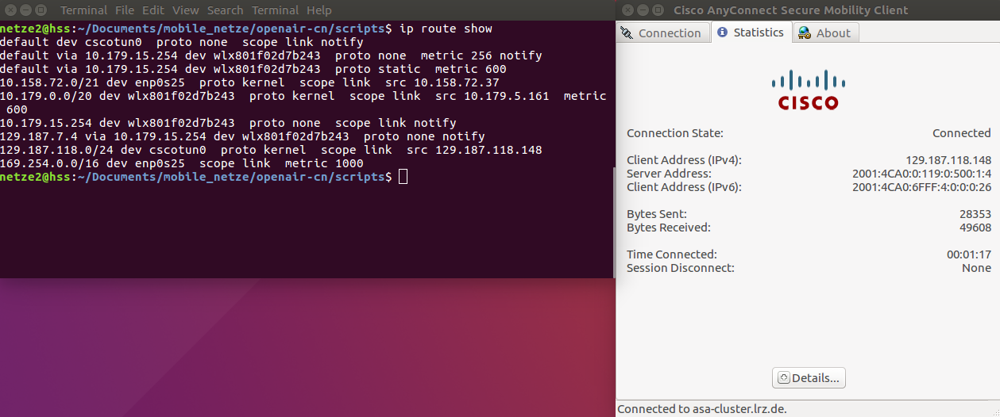

Abkürzungsverzeichnis
=====================

**eNodeB/eNB:** Evolved Node B  
**EPC:** Evolved Packet Core  
**EUTRAN:** Evolved UMTS Terrestrial Radio Access  
**GUMMEI:** Globally Unique Mobile Management Entity Identifer  
**HSS:** Home Subscriber Server  
**LTE:** Long Term Evolution  
**MME:** Mobility Management Entity  
**OAI:** Open Air Interface  
**OFDM:** Orthogonal Frequency Division Multiplexing  
**SDR:** Software Defined Radio  
**SMA** Sub-Miniature A
**S+P-GW:** Serving Gateway (S-GW) + PDN (Paket Data Network) Gateway (P-GW)  
**TAI:** Tracking Area Identity  
**UE:** User Equipment  
**UMTS:** Universal Mobile Telecommunications System  
**OFDM:** Orthogonal Frequency Division Multiplexing  
**UE:** User Equipment  
**GUMMEI:** Globally Unique Mobile Management Entity Identifer  
**TAI:** Tracking Area Identity  
**USRP:** Universal Software Radio Peripheral 
**3GPP:** 3rd Generation Partnership Project  
**SIM:** Subscriber Identity Module
**LAN:** Local Area Network
**APN:** Access Point Name

Einleitung
==========
Die vorliegende Projektdokumentation ist Teil der Veranstaltung „Mobile Netze“ an der Fakultät für Informatik und Mathematik (FK 07) der Hochschule München im Sommersemester 2017. Das Projekt dient dabei der Vertiefung der im Vorlesungsanteil erworbenen Kenntnisse und Fähigkeiten durch praktisches Experimentieren mit mobiler Kommunikation. Im Fall dieses Projekts, geht es um das Verständnis für die grundlegenden Prinzipien von LTE-Netzwerken, sowie die Kenntnis und praktische Erfahrungen mit dort verwendeten Techniken und Standards.

Projektüberblick und Ziele
--------------------------
Das Projekt befasst sich mit dem experimentellen Aufbau eines LTE-Netzwerks und versucht sich über dieses Netzwerk mit einem LTE-Stick ins Internet zu verbinden. Das Netzwerk, bestehend aus einer Evolved Node B (eNodeB) und dem Kernnetzwerk (Evolved Packet Core, EPC), soll dabei mit Hilfe des OpenAirInterface (OAI) simuliert werden.  
Im Kern ist das Projekt in die folgenden drei Stufen unterteilt:

- Stufe 1: Aufbau einer durchgehenden Verbindung von einem LTE-Stick über die eNodeB bis zur EPC (mit den Komponenten HSS, MME und S+P-GW) mit Hilfe des OpenAirInterface.
- Stufe 2: Erweiterung der Verbindung durch Anschluss an das Internet.
- Stufe 3: Evaluierung der Performance bzw. genauere Untersuchungen auf Protokollebene mit Wireshark.

Stufe 1 umfasst dabei die Minimalanforderungen an das Projekt. Die Stufen 2 und 3 sind entsprechende Erweiterungen der Mindestumsetzung.  
Der experimentelle Aufbau soll am Ende die Möglichkeit bieten, ein LTE-Netzwerk und dessen Zusammenhänge genauer zu untersuchen, um ein Verständnis für die Performance sowie die internen Abläufe der einzelnen Netzwerkkomponenten zu bekommen.

Relevante Grundlagen zu LTE
---------------------------
Der LTE (Long Term Evolution) Standard ist eine Weiterentwicklung von UMTS (Universal Mobile Telecommunications System) und wurde als erste Version in 3GPP Release 8 spezifiziert [@3gpprel8]. Mit 3GPP Release 10 (LTE Advanced) wurden zudem Erweiterungen spezifiziert, um das System noch schneller und effizienter zu machen.

Zu den wichtigsten Neuerungen von LTE gegenüber UMTS gehört zum einen ein neues Übertragungsverfahren und zum anderen der Fokus auf das paketvermittelnde Internet-Protokoll (IP). LTE verwendet das Übertragungsverfahren Orthogonal Frequency Division Multiplexing (OFDM), dass einen schnellen Datenstrom in viele langsamere Datenströme aufteilt und diese dann gleichzeitig überträgt. Dies führt zu einer erhöhten Datenrate unter LTE. „Während UMTS noch ein leitungsvermittelndes Kernnetz für Sprache-, SMS und andere Dienste hatte, gibt es in LTE nur noch ein paketvermittelndes Kernnetz, über das alle Dienste abgewickelt werden. Einzige Ausnahme ist der SMS-Dienst, der nach wie vor über Signalisierungsnachrichten abgewickelt wird.“ [@sauter15, S. 231 ff.]

Die LTE-Netzwerk-Architektur ist wie bei GSM und UMTS grob in ein Radionetz und ein Kernnetz unterteilt. Unter LTE wurde aber der Anteil logischer Komponenten reduziert, um die Effizienz zu steigern, Kosten zu senken und die Latenzzeiten zu minimieren.  
Die nachfolgende Abbildung zeigt alle Komponenten eines LTE-Netzwerks von den mobilen Endgeräten (UEs) bis hin zum Internet. Die Basisstationen (eNodeBs) bilden zusammen mit den UEs das oben bereits erwähnte Radionetz. Das Kernnetz besteht aus einer Teilnehmerdatenbank (HSS), dem Serving Gateway (Serving-GW), dem Paket Data Network Gateway (PDN-GW) sowie der Benutzerverwaltung (MME). Die MME ist der Netzwerkknoten, der für die Signalisierung zwischen den eNodeBs und dem Kernnetzwerk verantwortlich ist. Das Serving-GW ist verantwortlich für die Weiterleitung von Nutzerdaten in IP-Tunneln zwischen den eNodeBs und dem PDN-Gateway. Das PDN-Gateway bildet am Ende den Übergang zum Internet.


Verbunden sind alle Komponenten über die in obiger Abbildung gezeigten Schnittstellen, die nachfolgend aufgelistet und kurz beschrieben werden [@sauter15, S. 234 ff.]:

- S6a: Schnittstelle für den Informationsaustausch zwischen HSS und MME über das IP-basierte DIAMETER-Protokoll.
- S1: Schnittstelle zwischen den Basisstationen und dem Kernnetz.
  - S1-CP: Steuerebene (Control Plane) für die Kommunikation der eNodeBs mit dem Kernnetz (um sich beim Netzwerk anzumelden, um Status- und Keep-Alive-Nachrichten zu senden, um Konfigurationsinformationen vom Netzwerk zu erhalten) sowie dem Austausch benutzerspezifischer Signalisierung.
  - S1-UP: Nutzerebene (User Plane) zur Übertragung der Nutzdaten über das GPRS Tunneling Protocol (GTP).
- S11: Schnittstelle für die Übertragung von Kommandos der MME zum S-GW, über das GPRS Tunneling Protocol (GTP), wenn die MME neue Tunnel und deren Modifikation erstellt. Dies wird immer dann notwendig, wenn eine neue eNodeB von einer anderen MME und einem anderen S-GW bedient wird.
- S5: Schnittstelle zwischen dem SGW und dem PGW
  - S5-CP: Control Plane, über die die MME über das PGW eine IP-Adresse für ein Endgerät anfordert.
  - S5-UP: User Plane, zur Übertragung von Nutzdaten zwischen SGW und PGW über das GPRS Tunneling Protocol (GTP).
- SGi: Schnittstelle ins Internet.

OpenAirInterface (OAI)
----------------------
Das OpenAirInterface (OAI) ist eine Hardware und Software Technologie-Plattform zum Erstellen einer vollständigen und realitätsnahen LTE-Netzwerknachbildung. Die experimentelle LTE-Implementierung (Release 8 und partiell Release 10) des OAI ist in Standard C für mehrere Echtzeit-Linux-Varianten geschrieben, die für Intel x86 und ARM-Prozessoren optimiert und als freie Software unter dem OAI-Lizenzmodell veröffentlicht wurden. Die Implementierung beinhaltet sowohl EUTRAN (eNB und UE) als auch EPC (MME, S+P-GW, und HSS) und umfasst dabei den kompletten Protokoll-Stack des 3GPP Standards. Das OAI bietet eine umfangreiche Entwicklungsumgebung mit einer Reihe von integrierten Tools wie hoch realistische Emulationsmodi, Soft-Monitoring und Debugging-Tools, einen Protokollanalyzer, Performance-Profiler und ein konfigurierbares Logging-System für alle Layer und Kanäle. [@openairinterface]  
Im vorliegenden Projekt wird das OAI dazu genutzt, um eine LTE Base Station (OAI eNB) und ein Core Network (OAI EPC) auf je einem PC zu bauen und einzurichten (siehe die beiden folgenden Abbildung). Die OAI eNB kann entweder mit kommerziellen UEs oder OAI UEs verbunden werden, um verschiedene Konfigurationen und Netzwerkaufbauten zu testen und das Netzwerk sowie das mobile Gerät in Echtzeit zu überwachen. Im Folgenden steht jedoch die Verwendung eines kommerziellen User Equipments (UE) im Fokus.


Im Vergleich zum Standard LTE-Netzwerk aus Abbildung 1 werden im OpenAirInterface die beiden Komponenten SGW und PGW zu einer gemeinsamen Komponente (S+P-GW) zusammengeschlossen. Dadurch fällt auch die Schnittstelle S5 (CP und UP) als solches weg und wandert ins Innere von S+P-GW.  
Des Weiteren ist zu erwähnen, dass für die Erstellung der LTE-Netzwerknachbildung zum einen zahlreiche Tutorials [@oaitutorial] als auch entsprechende Mailing-Lists [@oaimailinglist] über die Homepage des OAI abrufbar sind. Diese kommen beim Aufsetzen der Projektumgebung (Kapitel 3) vermehrt zum Einsatz.

Versuchsaufbau
--------------
Der für die Umsetzung dieses Projekts erstellte Versuchsaufbau ist grob der untenstehenden Abbildung zu entnehmen. Er besteht aus den vier zentralen Komponenten UE, eNodeB, EPC und Internet, die nachfolgend alle kurz beschrieben werden.  
Das mobile Endgerät, sprich die UE, besteht aus einem Huawei LTE-Stick (E3372), der mit der Basisstation (eNodeB) verbunden ist. Darin zum Einsatz kommt eine durch das Labor zur Verfügung gestellte Test-SIM-Karte. Die eNodeB wird durch das OAI abgebildet und läuft auf einem physikalischen PC mit dem Betriebssystem Ubuntu 16.04 LTS. Da im Umfeld dieses Projekts nicht gefunkt werden darf, ist die Verbindung vom UE zur eNodeB kabelgebunden. Dafür wird neben einem Software Defined Radio (USRP B210) auch ein LTE Band7 Duplexer sowie entsprechende Dämpfungsglieder zwischen den LTE-Stick und die eNodeB geschalten. Die EPC, bestehend aus der MME, der HSS und dem S+P-GW, wird ebenfalls durch das OAI abgebildet und läuft auf einem zweiten physischen PC. Auch darauf läuft, wie von OAI für die EPC empfohlen, das Betriebssystem Ubuntu 16.04 LTS. Die vierte und letzte Komponente stellt dann noch das Internet dar, mit dem sich am Ende der LTE-Stick über die eNodeB und den EPC verbinden soll. Aufgrund von Routing-Problemen, ausgelöst durch den CiscoAnyConnect-VPN-Client, kommt für den Zugang zum Internet zusätzlich ein EDIMAX WLAN-Stick zum Einsatz.


Aufsetzen der Projektumgebung
=============================

In diesem Kapitel wird der Projektablauf beschrieben, was dem Aufbau, der Installation und Konfiguration des in dem vorhergehenden Kapitel beschriebenen Versuchsaufbaus entspricht. Besonders wird auf benötigte Komponenten und speziellen Konfigurationen eingegangen, die für die erfolgreiche Umsetzung essentiell gewesen sind.

Als Vorlage zum Vorgehen wurde ein Tutorial von OAI herangezogen. [@oaicotsuetutorial] Dieses gibt bereits eine gute Hilfe zum Einstieg und beschreibt die wichtigsten Schritte zum Aufbau des Netzes (ohne Internetverbindung). Leider ist es in manchen Punkten etwas zu ungenau bzw. nicht vollständig, sodass tiefgründigere und nicht vom Tutorial beschriebene Konfigurationen nötig waren. Hauptsächlich lag dies an abweichenden Rahmenbedingungen, weshalb im folgenden der gesamte Ablauf beschrieben wird.

Evolved Node B (eNodeB)
-----------------------------

Die eNodeB ist die Schnittstelle zwischen dem Kernnetz (EPC) und den Teilnehmergeräten (UEs). Es bildet eine Funkzelle, mit der einzelne UEs kommunizieren können und Daten von bzw. zum Kernnetz weitergeleitet werden. Der Aufbau besteht aus einem Universal Software Radio Peripheral (USRP) welches durch einen einen physischen Rechner betrieben wird. Der genaue Aufbau und die Konfiguration werden im folgenden Abschnitt beschrieben.

### Konfiguration der Hardware/Software

Als Betriebssystem für die eNodeB wird vom OAI ein Ubuntu in der Version 14.04.3 mit low-latency Kernel 3.19 empfohlen, da dieses für die Tests der OAI herangezogen wird. Grundsätzlich können auch andere Distributionen verwendet werden. Hier gibt es jedoch keine Garantie, dass die Build-Skripte sich erwartungsgemäß verhalten. Aus diesem Grund wurde das vorgeschlagene Ubuntu installiert.

Wichtig ist, dass das Betriebssystem auf einem physischen Rechner installiert wird und nicht auf einer virtuellen Maschine. Nur so kann die Echtzeitfähigkeit, welche durch den low-latency Kernel freigeschaltet wird, erreicht werden, die für die Verbindung mit der USRP benötigt wird. Nachdem das Betriebssystem auf dem Rechner installiert wurde, musste somit noch der low-latency Kernel installiert werden. Dies lies sich einfach durch den folgenden Befehl in der Kommandozeile erreichen:

```sh
  sudo apt-get install linux-image-3.19.0-61-lowlatency\
   linux-headers-3.19.0-61-lowlatency
```

Damit diese Änderung einen Effekt hatte, musste der Rechner neugestartet werden. Anschließend konnte der Erfolg durch den Befehl `uname -a` überprüft werden. Die Ausgabe entsprach folgender Meldung:

```sh
Linux [NAME] 3.19-lowlatency
```

Mit diesen Schritten wurde die Grundlage für die Installation des Openairinterfaces geschaffen, welche im nächsten Kapitel beschrieben wird.

### OAI Installationsvorbereitungen

Das Openairinterface liegt als Quelldateien in einem Git Repository vor. Es empfiehlt sich das gesamte Repository zu klonen, da man eventuell auf verschiedenen Branches und Tags zugreifen muss, falls es Probleme gibt. Auch bei diesem Aufbau gab es später Probleme die auf dem vorliegenden Quellcode basieren konnten, da man nach Anleitung auf dem `develop` Branch arbeitet. Um diese auszuschließen, war es hilfreich, ältere Tags auszuchecken und die Funktionen zu überprüfen. Aus diesem Grund wurde das Repository mit folgendem Befehl geklont.

```sh
git clone https://gitlab.eurecom.fr/oai/openairinterface5g.git
```

Nach erfolgreichem Download wurde in das Verzeichnis `openairinterface5g` gewechselt und die Working Copy auf den `develop`-Branch aktualisiert.

```sh
cd openairinterface5g
git checkout develop
git pull
```

Die vorliegenden Quelldateien konnten nun installiert werden. Bei diesem Vorgang werden die nötigen Abhängigkeiten nachgeladen und passend konfiguriert. Hierzu steht bereits ein automatisches Build-Skript bereit, welches wie folgt ausgeführt werden muss.

```sh
source oaienv
cd cmake_targets
./build_oai -I --eNB -x --install-system-files -w USRP
```

Was die einzelnen Parameter bewirken, wurde hier festgehalten:

 -I
~ Installiert die Abhängigkeiten

 --eNB
~ OAI Konfigurations-Flag für eNodeB

 -x
~ Fügt ein Software-Oszilloskop zu den erstellten Binärdateien

 --install-system-files
~ Installiert vom OAI benötigte Dateien ins Linux-System

 -w USRP
~ Konfiguriert den Hardwaresupport, was in diesem Fall `USRP` ist

Dies sind nicht alle Parameter, die zur Verfügung stehen. Mit dem Befehl `./build_oai -h` lassen sich alle möglichen Einstellungen und dessen Bedeutung anzeigen.

### Konfiguration der eNodeB

Nachdem die eNodeB erfolgreich installiert wurde, konnte sie für den Einsatz konfiguriert werden. Hierzu gibt es im Ordner `targets/PROJECTS/GENERIC-LTE-EPC/CONF/` verschiedene Konfigurationsdateien, die für unterschiedliche Frequenzbänder und eingesetzte Hardware gültig sind. Da hier eine eNodeB mit USRP-B210 im LTE Band 7 konfiguriert werden soll, war die Datei `enb.band7.tm1.usrpb210.conf` für diesen Anwendungsfall passend. Da nicht alle Konfigurationspunkte in der Datei angepasst werden mussten bzw. relevant für den weiteren Verlauf sind, werden in der folgenden Tabelle die wesentlichen Parameter beschrieben. Dabei werden auch die vergebenen Werte für die Eigenschaften angegeben, wobei diese bei einem Nachbau eventuell angepasst werden müssen.

| Eigenschaft | Wert | Bedeutung |
|-------------------------------------|---------------|------------------------------|
| tracking_area_code | 1 | Konfiguriert das Gebiet, in dem sich die eNB befindet. |
| mobile_country_code | 001 | Gibt die Länderkennung an, zu der die eNB gehört. |
| mobile_network_code | 93 | Setzt die Netzbetreiberkennung, zu der die eNB gehört. |
| **mme_ip_address** |
| ipv4 | 10.0.158.254 | IPv4 Adresse der MME, mit der sich die eNB verbinden soll. |
| ipv6 | 10:10:10::1 | IPv6 Adresse der MME, mit der sich die eNB verbinden soll. |
| active | yes | Mit diesem Flag wird die Verbindung zur MME aktiviert. |
| preference | ipv4 | Bestimmt die IP Art, die für die Verbindung bevorzugt wird. |
| **NETWORK_INTERFACES** |
| ENB_INTERFACE_NAME_ FOR_S1_MME | eth0 | Interfacename für die Verbindung zur MME bei der eNB. |
| ENB_IPV4_ADDRESS_ FOR_S1_MME | 10.0.158.254/24 | Adressbereich für die Verbindung zur MME bei der eNB. |
| ENB_INTERFACE_NAME_ FOR_S1U | eth0 | Interfacename für die Verbindung zur SPGW bei der eNB. |
| ENB_IPV4_ADDRESS_ FOR_S1U | 10.0.158.254/24 | Adressbereich für die Verbindung zur SPGW eNB. |
| ENB_PORT_ FOR_S1U | 2152 | Kommunikationsport für die Verbindung zur SPGW. |
| **component_carriers** |
| downlink_frequency | 2680000000L | Downlink-Frequenz für die eNB. (Hier Band 7) |
| uplink_frequency_offset | -120000000 | Offset für die Uplink-Frequenz von der DL-Frequenz. |

Bei den restlichen Konfigurationen haben die Standardwerte für dieses Projekt keinen Einfluss gehabt und werden daher nicht berücksichtigt. Die vollständige im Projekt verwendete Konfigurationsdatei befindet sich in der Anlage.

### Aufbau und erster Start der eNodeB

Nachdem die eNodeB konfiguriert war, konnte die USRP B210 mit dem System verbunden und gestartet werden. Hierzu wurde sie einfach mittels einer USB 3 Schnittstelle an den Rechner verbunden und mit folgendem Befehl gestartet:

```sh
cd cmake_targets/lte_build_oai/build
sudo -E ./lte-softmodem -O $OPENAIR_DIR/targets\
        /PROJECTS/GENERIC-LTE-EPC/CONF\
        /enb.band7.tm1.usrpb210.conf -d
```

Das LTE-Softmodem stellt dabei die Steuerung der USRP da und bildet die Schnittstelle zum Kernnetz. Wie man sieht, wird die zuvor konfigurierte Datei an das LTE-Softmodem übergeben und damit richtig eingestellt. Der letzte Parameter `-d` ist nicht zwingend notwendig. Dieser startet parallel eine grafische Oberfläche zur Analyse der eNodeB und dessen Signale.

Wenn die eNodeB richtig konfiguriert und angeschlossen ist, dann versucht diese sich mit dem Kernnetz, der EPC, zu verbinden. Wie diese aufgebaut und konfiguriert wurde, wird im folgenden Kapitel beschrieben.

Evolved Packet Core (EPC)
-------------------------

Der EPC ist neben der eNodeB das zweite zentrale Element des aufzubauenden LTE-Netzwerkes. Es setzt sich aus den drei Komponenten HSS, MME und SPGW zusammen. Dabei ist es möglich die einzelnen Komponenten des EPC auf verschiedenen Rechnern zu installieren. Im Rahmen dieses Projektes wurden der Einfachheit halber jedoch die EPC Komponenten auf einem Rechner installiert. Die einzelnen Schritte zur Installation und Integration des OAI EPC's werden in den Folgenden Abschnitten erörtert.

### Konfiguration der Hardware/Software

Als Betriebssystem für den EPC empfiehlt das OAI auf seiner Website Ubuntu 16.04 LTS (Xenial Xerus), welches auf einem physischen Rechner installiert werden sollte. Im Rahmen der Projektausführung wurde jedoch versucht den EPC zuerst auf einer Virtuellen Maschine (VM) mit Ubuntu 14.04 LTS (Trusty Tahr) zu installiert. Aufgrund eines Netzwerkproblems zwischen eNodeB-Rechner und der EPC-VM, wurde im weiteren Projektverlauf der EPC erneut auf einem physischen Rechner mit Ubuntu 16.04 LTS installiert. Verursacht wurde das Kommunikationsproblem durch den CiscoAnyConnect-VPN-Client auf dem eNodeB-Rechner, wodurch eNodeB und EPC nicht über das für die Signalisierung verwendete SCTP-Protokoll miteinander kommunizieren konnten. Dadurch war das Zusammenschließen von eNodeB und EPC nicht möglich. Deshalb wurde das EPC erneut auf einem physischen Rechner mit Ubuntu 16.04 LTS installiert.

Nach der Installation von Ubuntu 16.04 LTS auf dem physischen Rechner, wurde zuerst ein Kernelupgrade auf die Version 4.7.7 durchgeführt. Wichtig beim Upgrade des Kernels ist, dass dieser das GTP (GPRS Transport Protool) Modul beinhaltet. Auf `gitlab.eurocom.fr` stellt das OAI ein optimiertes Kernelpaket, welches das GTP-Modul enthält, zum Download bereit. Im Rahmen des Projektes wurde der zum Zeitpunkt der Projektdurchführung aktuelle Master-Branch des Kernel Git-Repositories verwendet.

Der Kernel wurde dann mit Folgenden Kommandos installiert:

```sh
cd ~/Documents
git clone https://gitlab.eurecom.fr/oai/linux-4.7.x.git
cd linux-4.7.x
sudo dpkg -i linux-headers-4.7.7-oaiepc_4.7.7-oaiepc-10.00.Custom_amd64.deb
             linux-image-4.7.7-oaiepc_4.7.7-oaiepc-10.00.Custom_amd64.deb
```

Mit dem Befehl `uname -r` lässt sich überprüfen ob die Kernelinstallation erfolgreich war oder nicht. Als Ausgabe in der Kommandzeile sollte hier `4.7.7-oaiepc` oder ähnlich erscheinen.

Im nächsten Schritt wurde der Hostnamen des Rechners angepasst. Für den EPC-Rechner wurder der Hostname `hss` gewählt. Prinzipiell kann für den EPC-Rechner jeder beliebige Hostname verwendet werden. Im weiteren Verlauf dieses Dokuments wird jedoch angenommen, dass der Hostname des EPC-Rechners `hss` lautet.

Zuerst wurde der Hostname mit nachfolgendem Befehl neu gesetzt.

```sh
sudo hostname hss
```

Anschließend wurde noch die `/etc/hosts`-Datei angepasst. Wie schon der Hostnamen, kann das Realm beliebig gewählt werden. Im weiteren Verlauf dieses Dokuments wird jedoch angenommen, dass der Real des EPC-Rechners `openair4G.eur` lautet.

```sh
sudo nano /etc/hosts

127.0.0.1    localhost
127.0.1.1    hss.openair4G.eur    hss

```

Nachdem dem Kernelupdate und dem Anpassen des Hostnames sowie der Hosts-Konfiguration, empfiehlt es sich den Rechner neu zu starten und die vorher getätigten Anpassungen noch einmal zu überprüfen. So kann es eventuell passieren, dass während dem Bootvorgang ein anderer Kernel, als der zuvor installierte, geladen wird. Dies lässt sich beheben in dem man beim Bootvorgang in Grub den korrekten Kernel manuell wählt. Damit nicht bei jedem Neustart des EPC-Rechners der Kernel manuell gewählt werden muss, empfiehlt es sich in der  `/etc/default/grub` Konfigurationsdatei den `GRUB_DEFAULT` Wert anzupassen. Der Wert `0` bedeutet, dass der Default Kernel geladen wird. Entweder wird der `GRUB_DEFAULT`-Wert auf den Index des beim Bootvorgang gewünschten Kernels oder auf den vollen Namen des Kernels, so wie er im Grub-Bootmenu angezeigt wird, gesetzt. Vorsicht vor Tippfehlern, denn die können dazu führen, dass der Rechner unter Umständen nicht mehr korrekt startet.

### EPC Installationsvorbereitungen

Im Vorherigen Abschnitt wurde beschrieben, wie ein Rechner für die Installation des OAI-EPCs vorbreitet werden muss. In nachfolgendem Abschnitt wird angenommen, dass die Installation und Vorbereitung des Rechners nach der Anleitung im vorherigen Abschnitt durchgeführt wurde.

Zuerst wurde der Sourcecode für das EPC ausgecheckt.

```bash
git clone https://gitlab.eurecom.fr/oai/openair-cn.git
```

Nach erfoglreichem Download wurde in das Verzeichnis `openair-cn` gewechselt und die Working Copy auf den `develop`-Branch aktualisiert.

```bash
cd openair-cn
git checkout develop
git pull
```

Mit `git status` lässt sich überprüfen ob die Working Copy tatsächlich auf dem aktuellsten Stand ist. Anschließend wird in das `<openair-cn>/scripts`-Verzeichnis gewechselt und nacheinander jede EPC-Komponente einzelnen kompiliert. Die Befehle zum Kompilieren der Komponenten sollten der Reihe nach und sperat ausgeführt werden.

```bash
./build_mme -i
./build_hss -i
./build_spgw -i
```

Während des Kompiliervorgangs der einzelnen Komponenten werden zusätzliche System Abhängigkeiten installiert. Hierbei muss interaktiv die Installation verschiedener Pakete zugelassen werden. Des Weiteren wird ein MySQL-Server, sofern nicht vorhanden, und phpMyAdmin als Datenbanktool installiert und eingerichtet. Ein Stolperstein bei der Installation von phpMyAdmin ist die korrekte Auswahl des Webservers im Installationsmenü vorzunehmen. Hier sollte darauf geachtet werden, dass der gewünschte Webserver für die Ausführung von phpMyAdmin durch ein vorangestellten roten Punkt gekennzeichnet ist.

Nach erfolgreicher Installation von MME, HSS und S+P-GW kann noch überprüft werden ob der MySQL-Server und phpMyAdmin auf dem EPC-Rechner korrekt installiert wurden. Dazu navigiert man im Browser auf `http://localhost/phpmyadmin`. Erscheint hier die phpMyAdmin-Seite und man kann sich erfolgreich mit den beim Installationsvorgang vergebenen Credentials anmelden, war die Installation des MySQL-Servers erfolgreich.

### Konfiguration von HSS, MME und S+P-GW

Nach der erfolgreichen Installation von MME, HSS und S+P-GW, wurden die Konfigurationsdateien jeder Komponente angepasst. Dazu wurden zuerst die Standardkonfigurationsvorlagen einer jeden Komponenten nach `/usr/local/etc/oai` kopiert. Außerdem wurde das Verzeichnis `/usr/local/etc/oai/freeDiameter` erstellt.

Die Konfigurationsdateien wurden über folgende Befehele kopiert:

```bash
sudo cp ~/openair-cn/etc/mme.conf /usr/local/etc/oai
sudo cp ~/openair-cn/etc/hss.conf /usr/local/etc/oai
sudo cp ~/openair-cn/etc/spgw.conf /usr/local/etc/oai
sudo cp ~/openair-cn/etc/acl.conf /usr/local/etc/oai/freeDiameter
sudo cp ~/openair-cn/etc/mme_fd.conf /usr/local/etc/oai/freeDiameter
sudo cp ~/openair-cn/etc/hss_fd.conf /usr/local/etc/oai/freeDiameter
``` 

In tabellarischer Form werden nachfolgend für jede Komponente seperat die angepassten Konfigurationsparameter aufgelistet und kurz hinsichtlich ihrer Funktion beschrieben.

`/usr/local/etc/oai/mme.conf`

| Eigenschaft | Wert | Bedeutung  |
|-------------------------------------|---------------|------------------------------|
| REALM | `openair4G.eur` | Definiert den Domainbereich unter dem MME, HSS und S+P-GW ansprechbar sind. Wenn bei der Konfiguration des Hosts ein anderes Realm als `openair4G.eur` verwendet wurde, muss dieser Parameter entsprechend angepasst werden. |
| GUMMEI_LIST | TODO | Konfiguriert die von der MME zur Verfügung gestellten GUMMEIs. Im Rahmen der Projektdurchführung wurden ein MCC von `001` und ein MNC von `93` verwendet. |
| TAI_LIST | TODO | Konfiguriert den TAI der MME. Für den MCC und den MNC in der TAI_LIST wurden die selben Werte wie für die GUMMEI_LIST verwendet. |
| MME_INTERFACE_NAME_ FOR_S1_MME | `eth0` | Konfiguriert das für die S1-Signalisierung zu verwendende Netzwerkinterface. Hier muss ein Netzwerkinterface eingetragen werden, über das die eNB erreicht werden kann. |
| MME_IPV4_ADDRESS_ FOR_S1_MME | `10.0.158.10/24` | Definiert unter welcher IP-Adresse und Subnetzmaske die MME auf S1-Signalisierungsnachrichten reagiert. Unter Umständen muss hier die Subnetzmaske angepasst werden, sofern sich das Netzwerkgateway ändern sollte. |


`/usr/local/etc/oai/mme_fd.conf`


| Eigenschaft | Wert | Bedeutung |
|-------------------------------------|---------------|------------------------------|
| Identity | `hss.openair4G.eur` | Der Hostname unter dem die MME erreichbar ist. Dieser wurde von `yang.openair4G.eur` zu `hss.openair4G.eur` geändert.
| Realm | `openair4G.eur` | Der Domainbreich muss nur angepasst werden, wenn der Standarddomainbereich `openair4G.eur` nicht verwendet wurde.


`/usr/local/etc/oai/hss.conf`

| Eigenschaft | Wert | Bedeutung |
|-------------------------------------|---------------|------------------------------|
| MySQL_user | `root` | Benutzername des Datenbanknutzers, der bei der Installation des MySQL-Servers angegeben wurde. |
| MySQL_pass | `wlankabel42` | Passwort des Benutzernamens. |
| OPERATOR_key | `` | Zeichenkette die zur dynamischen Generierung des SIM-Karten OPcs verwendet wird. Im Rahmen der Projektumsetzung wurde auf die dynamische Generierung verzichtet, da die zur Verfügung stehenden SIM-Karten mit einem festen OPc programmiert wurden. Dazu wurde der Wert auf Leerstring gesetzt. |

`/usr/local/etc/oai/hss_fd.conf`

| Eigenschaft | Wert | Bedeutung |
|-------------------------------------|---------------|------------------------------|
| Identity | `hss.openair.4G.eur` | Der Hostname unter dem der HSS erreichbar ist. Hier entspricht der Standardwert dem im Projekt verwendeten Hostnamen `hss.openair4G.eur`. |
| Realm | `openair4G.eur` | Der Domainbreich muss nur angepasst werden, wenn der Standarddomainbereich `openair4G.eur` nicht verwendet wurde. |

`/usr/local/etc/oai/spgw.conf`

| Eigenschaft | Wert | Bedeutung |
|-------------------------------------|---------------|------------------------------|
| SGW_INTERFACE_NAME_ FOR_S1U_S12_S4_UP | `eth0` | Konfiguriert das für S1U-, S12- und S4-Signalisierungsnachrichten zu verwendende Netzwerkinterface. Hier muss ein Netzwerkinterface eingetragen werden, über das die eNB erreicht werden kann. |
| SGW_IPV4_ADDRESS_ FOR_S1U_S12_S4_UP | `10.0.158.10/24` | Definiert unter welcher IP-Adresse und Subnetzmaske das S-GW auf Signalisierungsnachrichten reagiert. Unter Umständen muss hier die Subnetzmaske angepasst werden, sofern sich das Netzwerkgateway ändern sollte. |
| PGW_INTERFACE_NAME_ FOR_SGI | `wlan0` | Konfiguriert das für die Internetanbindung zu verwendende Netzwerkinterface. Hier muss ein Netzwerkinterface eingetragen werden, welches über Internetanbindung verfügt. | 
| PGW_MASQUERADE_SGI | `yes` | Über diesen Parameter kann konfiguriert werden, ob das P-GW Netzwerkadressübersetzung durchführt oder nicht. Der Standardwert ist `no`. Bei der Projektumsetzung wurde der Wert auf `yes` gesetzt. |
| UE_TCP_MSS_CLAMPING | `yes` | Über diesen Parameter kann konfiguriert werden, ob das P-GW die Anzahl der Bytes für Nutzerdaten maximieren soll oder nicht. Der Standardwert ist `no`. Bei der Projektumsetzung wurder der Wert auf `yes` gesetzt, da mit dem Standardwert keine Internetkommunikation möglich war. |
| DEFAULT_DNS_IPV4_ ADDRESS | `8.8.8.8` | Konfiguriert den Standard DNS-Server, welcher den UE beim Verbindungsaufbau mit dem P-GW mitgeteilt wird. |
| DEFAULT_DNS_SEC_ IPV4_ADDRESS | `8.8.8.4` | Konfiguriert den abgesicherten Standard DNS-Server, welcher den UE beim Verbindungsaufbau mit dem P-GW mitgeteilt wird. |


Neben der zurvor getätigten Konfiguration des EPCs, wurden noch zwei Zertifikate für MME und HSS installiert. Mit Hilfe dieser beiden Zertifikate wird die S6a-Schnittstelle zwischen MME und HSS abgesichert. Zum installieren der Zertifikate wurde in das `<openair-cn>/scripts`-Verzeichnis gewechselt. Anschließend wurde die Installation der Zertifikate wie folgt vorgenommen:

```bash
./check_hss_s6a_certificate /usr/local/etc/oai/freeDiameter/ hss.openair4G.eur
./check_mme_s6a_certificate /usr/local/etc/oai/freeDiameter/ hss.openair4G.eur
```

Wurden MME und HSS auf seperaten Rechnern installiert oder ein anderer Hostname und/oder anderes Realm als `hss` beziehungsweise `openair4G.eur` verwendet, müssen oben stehende Kommandos entsprechend angepasst werden.

Bevor die Installation des EPCs fortgesetzt wurde, wurde unter `<openair-cn-dir>/src/common` die Header-Datei `common_types.h` angepasst. Denn hier befindet sich ungefähr in Zeile 88 ein Bug, durch den IMSI's mit zwei führenden Nullen nicht korrekt erkannt werden. Da im Rahmen des Projektes ein MCC von `001` verwendet wurde, musst die Datei entsprechend angepasst werden:

```c
// Quelle: https://gitlab.eurecom.fr/oai/openair-cn/commit/0d574905cbdedd30fdba7f6e3062db268761f0b7
// #define IMSI_64_FMT              "%"SCNu64
// Erkennt nun auch IMSI's der Struktur 001############
#define IMSI_64_FMT              "%015"SCNu64
``` 

### Installation von HSS, MME und S+P-GW

Nachdem der EPC der Anleitung gemäß konfiguriert wurde, wurden die einzelnen Komponenten der Reihe nach installiert. Dazu wurde in das `<openair-cn>/scripts`-Verzeichnis gewechselt.

Zuerst wurde der HSS erneut kompiliert und anschließend gestartet. Beim erstmaligen Starten des HSS wurde über den Parameter `i` ein SQL-Skript übergeben, dass das erforderliche Datenbankschema und einige IMSI-Einträge enthält.

```bash
./build_hss -c # Muss nur dann aufgerufen werden, wenn der Sourcecode angepasst wurde.
./run_hss -i ~/openair-cn/src/oai_hss/db/oai_db.sql  # Erstmaliges starten des HSS
./run_hss
```

Bevor die MME-Installation forgesetzt wurde, wurde in der zuvor erstellten Datenbank `oai_db` der Hostname des EPC-Rechners eingetragen. Dazu wurde über ein MySQL-Client zur Tabelle `mmeidentitiy` folgende Zeile hinzugefügt:

```sql
INSERT INTO mmeidentity (`mmehost`, `mmerealm`, `UE-Reachability`)
  VALUES ('hss.openair4G.eur', 'openair4G.eur', 0);
```

Wird ein anderer Hostname oder Realm wie in dieser Projektumsetzung verwendet, muss obiges SQL-Statment entsprechend angepasst werden. Desweiteren empfiehlt es sich die ID des neu angelegten Eintrags zu merken, da dieser später beim Eintragen von SIM-Konfigurationen in die `users`-Tabelle als Fremdschlüssel-ID benötigt wird.

Als nächstes wird die MME installiert. Dazu führt man folgende Befehle aus:

```bash
./build_mme -c # Muss nur dann aufgerufen werden, wenn der Sourcecode angepasst wurde.
./run_mme
```

Nach erfolgreichem Start von HSS und MME, wurde in den Logs beider Komponenten die Nachricht `STATE_OPEN` angezeigt.

Zum Schluss wird das S+P-GW installiert und gestartet. Dazu für man folgende Befehle aus:

```bash
./build_spgw -c # Muss nur dann aufgerufen werden, wenn der Sourcecode angepasst wurde.
./run_spgw
```

Nachdem alle EPC Komponenten störungsfrei liefen, wurde als nächstes die im vorherigen Kapitel installierte eNodeB gestartet und mit dem EPC verbunden. In den MME-Logs wurde dann angezeigt, dass eine eNodeB mit dem EPC verbunden ist.

User Equipment (UE) und SIM Karten (Fabian)
----------------------------------
Für die Umsetzung unseres LTE Projekts verwendeten wir ein handelsübliches User Equipment. Wir entschieden uns für den HUAWEI LTE Surfstick E3372. Als SIM Karte verwendeten wir eine Open Cells SIM, die wir von Open Cells Project (https://open-cells.com/index.php/sim-cards/) geordert hatten. Der Vorteil von diesen Karten ist, dass diese jederzeit durch uns selbst umprogrammiert werden können. Bereits bei der  Bestellung konnten wir Open Cells alle Werte für die SIM Karten vorgeben, wodurch wir fertig konfigurierte SIM Karten zurück erhielten.

Zunächst ein Auszug von den Spezifikationen des Sticks.

Hardware:

| Thema | Eigenschaft |
|-------------------------------|------------------------------------------------------|
| technischer Standard |- LTE Rel 9						       |
|		       |- WCDMA Rel ‘99 plus Rel 5 HSDPA, Rel 6 HSUPA, Rel 7	       |
|		       |- HSPA+(cat 14), Rel 8 DC-HSPA+(cat 24)			       |
|		       |- GSM/GPRS/EDGE Rel 99					       |
|		       |	          					       |
| unterstüzte Frequenzen |- LTE FDD 800MHz (832MHz~862MHz(Uplink)/791MHz~821MHz(Downlink))|
| 			 |- LTE FDD 1800MHz					       |
| 			 |- LTE FDD 2600MHz (2500MHz\~2570MHz(Uplink)/2620MHz\~2690MHz(Downlink))|
| 			 |- LTE FDD/WCDMA/HSPA+ (2100MHz (1920MHz~1980MHz(Uplink)/2110MHz\~2170MHz(Downlink))|
| 			 |- LTE FDD/WCDMA/HSPA+ (900MHz 880MHz\~915MHz(Uplink)/925MHz\~960MHz(Downlink))|
| 			 |- GSM/GPRS/EDGE 850MHz (824MHz\~849MHz(Uplink)/869MHz\~894MHz(Downlink))|
| 			 |- GSM/GPRS/EDGE 900MHz (880MHz\~915MHz(Uplink)/925MHz\~960MHz(Downlink))|
| 			 |- GSM/GPRS/EDGE 1800MHz ((1710MHz\~1785MHz(Uplink)/1805MHz\~1880MHz(Downlink))|
| 			 |- GSM/GPRS/EDGE 1900MHz (1850MHz\~1910MHz(Uplink)/1930MHz\~1990MHz(Downlink))|
|		       |	          					       |
| externe Schnittstellen |- USB 2.0 High Speed 					       |
|		       |- SIM/USIM Karte       					       |
|		       |- microSD Kartenslot   					       |
|		       |- 2 externe Antennenanschlüsse				       |
|		       |	          					       |
|statische Empfängerempfindlichkeit |- LTE FDD 2100/1800/2600)/900/800 MHz gemäß 3GPP TS 36.101(R9)|
|		       |- WCDMA/HSPA/HSPA+ 2100/900MHz entspricht 3GPP TS 25.101(R8)     |
|		       |- GSM/GPRS/EDGE 850/900/1800/1900MHz entspricht 3GPP TS 05.05 (R99)|

Software & Mobilfunk:

| Thema | Eigenschaft |
|-------------------------------|------------------------------------------------------|
|Basis Spezifikation   |- kein Driver notwendig					       |
|		       |- WebUI	          					       |
|		       |- automatisches Verbinden und Trennen			       |
|		       |- automatische Installation				       |
|		       |	          					       |
|PIN Management	       |- Aktivierund und Deaktivierung der PIN 		       |
|		       |- PIN ändern und sperren 				       |
|		       |- PIN entsperren mit PUK				       |
|		       |	          					       |
|Netwerkverbindungssetup|- APN Management	         			       |
|		       |- automatische sowie manuelle Netzsuswahl und Registrierung    |
|		       |							       |
|Übertragungstechnik    |- LTE 2*2 MIMO						       |
|		       |							       |
|Mobilfunk Management  |- LTE Intra-Frequenz Handover und Inter-Frequenz Handover      |
|		       |- LTE und UMTS Inter-RAT Idle Mobilität		               |
|		       |- LTE und GERAN Inter-RAT Idle Mobilität	               |
|		       |- LTE und UMTS Inter-RAT Verbindungsmobilität 		       |
|		       |- LTE und GERAN inter-RAT Verbindungsmobilität wird unterstütz durch CCO(cell change order)|

\begin{figure}[htbp]
\centering
\includegraphics[width=0.5\textwidth]{img/huaweiE3372.png}
\caption{HUAWEI LTE Surfstick E3372}
\end{figure}

Ein Punkt der Spezifikationsbeschreibung des Sticks beinhaltet die automatisch Installation. Dies wird vermutlich in der Regel durch die Software des Sticks und den gängigen Betriebssystemen auch unterstützt. Im Projekt wurde jedoch Linux als Betriebssystem eingesetzt, wodurch die automatische Softwareinstalltion nicht funktionierte. Bei Linux müssen Surfsticks, die gleichzeitig auch als Speicherstick verwendet werden können, in den passenden Modus umgeschaltet werden. Standardmäßig wird der E3372 vom Linux Betriebssystem als Massenspeichergerät erkannt. Dies kann durch folgendes Terminalkommando geprüft werden:

```bash
lsusb
```


Über die BUS und Geräte Nummer erhält man weitere detailierte Informationen wie z. B. Herstelle ID und Produkt ID zum erkannten USB Gerät.
```bash
lsusb -vs  001:088
```


Um den HUAWEI LTE Surfstick als Mobilfunkgerät verwenden zu können, muss ein Moduswechsel vom Massenspeichergerät zum Modem bzw. zur Netzwerkkarte stattfinden. Hierfür wird die Hersteller-ID sowie Produkt-ID des Gerätes benötigt. 

Die Umsetzung des Moduswechsels ist nicht für jeden Mobilfunkstick gleich. Für den erfolgreichen Wechselprozess des E3372 wurde zunächst die `/etc/usb_modeswitch.conf` um die nachfolgenden Codezeilen erweitert.

`#Huawei E353`

`TargetVendor=0x12d1`

`TargetProductList="1f01"`

`HuaweiNewMode=1`

`NoDriverLoading=1`

Falls der LTE Stick an einer USB 3 Schnittstelle verwendet werden soll, dann sollte zur Sicherheit die StorageDelay Option in der gleichen Konfigurationsdatei aktiviert sein. Die dafür notwendigen Einstellungen sind bereits in der Konfigurationsdatei vorhanden, sind jedoch durch das \# Symbol deaktiviert.

`#SetStorageDelay=4`

Hinweis: Die Projekterfahrungen haben gezeigt, das der USB Stick an einer USB 2 Schnittstelle eher bzw. besser erkannt wird. Am USB 3 Port gab es oft Probleme mit der Erkennung des E3372 und der späteren Umstellung auf den Modem Modus. 

Nachdem die Vorbereitungen für den Moduswechsel abgeschlossen sind und der LTE Stick vom System vollständig erkannt wurde, wird dieser durch einen Konsolenbefehl vom Massenspeicher zum Modem. Wichtig hierbei ist, dass der Stick richtig vom Betriebssystem erkannt wird. Teilweise wurde der Stick bereits über den `lsusb` Befehl aufgelistet, obwohl er noch nicht vollkommen betriebsbereit war. In unserem Fall erschien das Stick als Massenspeicher in der Symbolleiste und der Autostart der daraufbefindlichen Software wollte starten. Wird das nachfolgende Kommando vor der vollständigen Erkennung ausgeführt, so wechselt zwar der LTE Stick in den Modem Modus, erzeugt aber keine neue Netzwerkschnittstelle auf dem PC und funktioniert somit nicht richtig.

\begin{figure}[htbp]
\centering
\includegraphics[width=0.8\textwidth]{img/autostart_lte-stick.png}
\caption{LTE Stick als Massenspeicher}
\end{figure}

```bash
sudo usb_modeswitch -v 12d1 -p 1f01 -M '555342431234567800000000000000110620000
00101000100000000000000'
```
Mit dem Parameter `v` wird die Hersteller ID (Vendor ID), mit `p` die Produkt ID und mit `M` der gewünschte Switch-Modus angegeben. Die Werte der ersten beiden Parameter sind eindeutig durch das Gerät vorgegeben. Der letztere ist stark abhängig vom Geräte Modell. Bei einem anderen HUAWEI LTE Stick war zum Beispiel der Wert des `M` Parameters *55534243123456780000000000000011062000000100000000000000000000*. Obwohl die beiden Werte sich nur an einer Stelle unterscheiden, ist dies ausschlaggebend ob der Moduswechsel erfolgreich ist oder nicht. Auch die Anpassung der `/etc/usb_modeswitch.conf` Datei ist nicht bei jedem LTE Stick notwendig.

Ist der Moduswechsel erfolgreich gewesen, so erscheint zum einen auf der Konsole eine Meldung und zum anderen hat sich die Produkt ID geändert. Außerdem erzeugt der Stick, nach dem er in den Modem Modus gewechselt ist, ein neue Netzwerkschnittstelle auf dem PC.

 \ 

Neben dem Kommando `lsusb` zur Prüfung des LTE Stick Moduses kann auch der Befehl `dmesg -T` verwendet werden. Dieser zeigt die letzten Änderungen vom Kernel Ring Buffer an.

`lsusb` Kommando:

 \ 

`dmesg -T` Kommandos:

- Massenspeicher

 \ 

- Modem

 \ 

Wird der Befehl `ifconfig` ausgeführt, dann ist zu erkennen, dass ein neues Interface hinzugekommen ist. Mittels des `dmesg` Kommandos war zu sehen, dass eine Umbenennung von *eth0* auf einen kryptischen langen Interface Namen stattfand.  

 \ 

Der letzter Indikator, dass die Umschaltung erfolgreich war, ist die Weboberfläche des LTE Sticks. Diese ist durch Eingabe von `http://192.168.8.1/html/home.html` im Browser dann erreichbar.

\begin{figure}[htbp]
\centering
\includegraphics[width=1\textwidth]{img/webUI.png}
\caption{Weboberfläche des HUAWEI LTE Surfstick E3372}
\end{figure}

Aufbau der Projektumgebung
--------------------------
Damit wir kein öffentliches LTE Netz stören, mussten wir alle Komponenten per Kabel miteinander verbinden. Gemäß nachfolgender Abbildung wurde das UE direkt an einem Band 7 Duplexer angeschlossen. Dieser ist wiederum mit der RX und TX Schittstelle des URSP B210, der die eNB darstellt, gekoppelt. Auf der URSP Emfangs- und Senderschnittstelle ist jeweils ein 20dB (50 Ohm) Dämpfungsglied aufgeschraubt. Das USRP hat mittels USB 3 eine Verbindung mit einem handelsüblichen PC. Dieser und ein weiterer Rechner, welcher später die EPC darstellen wird, haben die Möglichkeit per LAN miteinander zu kommunizieren. 

 \ 

Nachdem alle notwendigen Komponenten installiert, konfiguriert und miteinander verbunden wurden, wurden sie nun in Betrieb genommen. Dabei ist eine gewisse Reihenfolge zu beachten, außer beim UE. Dies ist unabhängig von allem anderen. 

Als erstes muss der HSS mit dem Konsolenkommando ```./run_hss ``` gestartet  werden. Läuft das gestartet Skript ohne Probleme durch, so erscheint am Ende auf der Terminalausgabe *"Initializing s6a layer: Done"*.

\begin{figure}[htbp]
\centering
\includegraphics[width=1\textwidth]{img/Start_HSS.png}
\caption{Start HSS}
\end{figure}

Nach der HSS muss nun die MME starten. Dies erfolgt indem in die Konsole ```./run_mme``` eingegeben wird. Ist auch hier das zugehörige Skript erfolgreich durchgelaufen, dann ändert sich der Status der HSS von *"STATE_CLOSED" zu "STATE_OPEN"*. Die MME zeigt ebenfalls an, dass sie mit der HSS verbunden ist.

\begin{figure}[htbp]
\centering
\includegraphics[width=1\textwidth]{img/MME_HSS_Start.png}
\caption{Start MME}
\end{figure}

Als letztes aus dem EPC wird das S+PGW gestartet. Hierfür wird ```./run_spgw``` im Terminal eingegeben. Ähnlich wieder bei der HSS kommt nach vollständigem Durchlaufs des Skriptes eine Erfolgsmeldung - *"Initializing SPGW-APP task interface: DONE"*

\begin{figure}[htbp]
\centering
\includegraphics[width=1\textwidth]{img/SPGW_Start.png}
\caption{Start SPGW}
\end{figure}

Für ein vollständiges LTE Mobilfunknetz fehlt noch eine funktionstüchtige eNB. Diese wird als letztes mit dem gewünschten Frequenzband in Betrieb genommen. Wir haben mit dem folgenden Kommando die eNB mit dem Frequenzband 7 (2,6 GHz) gestartet. 
```bash
sudo -E ./lte-softmodem -O $OPENAIR_DIR/targets/PROJECTS/GENERIC-LTE-EPC/CONF/
enb.band7.tm1.usrpb210.conf
``` 
\newpage
Nachdem die eNB läuft und sich erfolgreich mit der MME verbunden hat, wird dies durch die MME im Terminal oder im Log angezeigt. Ab diesem Zeitpunkt senden sich die eNB und MME in regelmäßigen Abständen *HEARTBEAT* Nachrichten zu, um somit zu überprüfen ob die Gegenseite noch erreichbar ist.
\begin{figure}[htbp]
\centering
\includegraphics[width=0.9\textwidth]{img/MME_eNB_Start.png}
\caption{Start eNB und Verbindung mit MME}
\end{figure}

Da jetzt alle Komponenten laufen und miteinander verbunden sind, haben wir ein funktionsfähiges LTE Netz geschaffen.
Nun sind wir in der Lage ein UE, wo zuvor die zugehörigen Daten der SIM Karte in den HSS eingetragen wurden, mit dem Mobilfunknetz zu verbinden. In den nachfolgenden Bildern ist zu erkennen, wie sich das UE mit dem Netz verbindet. Genau wie bei der Verbindung zwischen eNB und MME, zeigt uns diese hier ebenfalls an, wenn ein UE sich erfolgreich verbunden oder getrennt hat.
\begin{figure}[htbp]
\centering
\includegraphics[width=0.9\textwidth]{img/UE_eNB_Connect.png}
\caption{Verbindung UE mit eNB}
\end{figure}


\begin{figure}[htbp]
\centering
\includegraphics[width=0.9\textwidth]{img/UE_MME_HSS_Connect.png}
\caption{Verbindung UE mit Mobilfunknetz}
\end{figure}

\newpage
Neben der MME zeigt auch das eine erfolgreiche Verbindung mit dem Netz an. Damit das UE nun auch im Internet surfen kann, muss nur noch der richtige APN eingetragen sein.

\begin{figure}[htbp]
\centering
\includegraphics[width=0.9\textwidth]{img/network_available.png}
\caption{Verfügbares Mobilfunknetz}
\end{figure}

\begin{figure}[htbp]
\centering
\includegraphics[width=0.9\textwidth]{img/lte_apn.png}
\caption{Verfügbares Mobilfunknetz}
\end{figure}

\begin{figure}[htbp]
\centering
\includegraphics[width=0.9\textwidth]{img/systeminfos.png}
\caption{Systemeinstellung des LTE Sticks}
\end{figure}

\begin{figure}[htbp]
\centering
\includegraphics[width=0.9\textwidth]{img/connected.png}
\caption{HUAWEI LTE Surfstick E3372 mit Mobilfunknetz verbunden}
\end{figure}

Herstellen einer Internetverbindung
===================================

Das 2. Ziel dieses Projektes war, eine Internetverbindung über das LTE Netz an die UE zu bringen. Da das SPGW die Schnittstelle zum Internet darstellt und von dem einen ins andere Netz übersetzt, musste diese angepasst werden. Hierzu musste im ersten Schritt das Netzwerk-Interface, an dem die Verbindung zum Internet besteht, in der SPGW eingetragen werden. Dies waren dabei die relevanten Parameter:

Konfigurationsdatei: `/usr/local/etc/oai/spgw.conf`

| Eigenschaft | Wert | Bedeutung |
|-------------------------------------|---------------|------------------------------|
| **P-GW NETWORK_INTERFACES** |||
| PGW_INTERFACE_NAME_ FOR_SGI | wlan001 | Name des Interfaces über die eine Internetverbindung besteht. |
| PGW_IPV4_ADDRESS_ FOR_SGI | 10.0.158.10/24 | IP-Adressbereich des Interfaces über die eine Internetverbindung besteht. |
| PGW_MASQUERADE_SGI | yes | Aktiviert die Übersetzung von internen IP-Adressen im LTE Netz auf IPs im externen Netz. (NAT) |
| UE_TCP_MSS_CLAMPING | yes | Aktiviert die Abstimmung von max. Paketgrößen für Netze mit unterschiedlichen Maximum Transmission Units (MTUs). |
||||
| DEFAULT_DNS_ IPV4_ADDRESS | 158.10.20.1 | DNS Server Adresse zur Auflösung von Domainnamen im IPv4 Bereich |
| DEFAULT_DNS_SEC_ IPV4_ADDRESS | 158.10.20.1 | DNS Server Adresse zur Auflösung von Domainnamen im IPv4 Bereich mit Authentizitäts- und Integritätsprüfung |

An dieser Stelle sind mehrere Parameter sehr wichtig. Zu aller erst sei das Interface für die Verbindung zum Internet erwähnt. Im Versuchsaufbau war ursprünglich eine Internetverbindung vom internen Netz über ein mittels Cisco Client aufgebautes virtuell private Network (VPN) realisiert. Aus diesem Grund war zunächst der Parameter `PGW_INTERFACE_NAME_FOR_SGI` mit dem Wert `cscotun0` gesetzt. Doch dies brachte leider ungewollte Nebeneffekte mit sich. Der Cisco Client hat standardmäßig die Einstellung, dass sämtliche Netzwerkrouten im System auf das eigene Interface umgeleitet werden. Mit dem Befehl `ip route show` kann man sich dieses Verhalten bei aktiviertem VPN anschauen und sieht wie folgt aus:

\ 

Hier ist zu erkennen, dass die Verbindungen für das `gtp` Interface vom `cscotun0` Interface vorher abgegriffen werden und somit nicht zur SPGW gelangen. Dies ließ sich durch den Befehl `ping 176.0.0.1` schnell nachstellen, wobei die Verbindung von der UE zur SPGW getestet wurde. Um dieses Verhalten zu unterbinden, wurden die Routen mit dem `route add` Befehl versucht umzuschreiben. Leider brachte dieser Ansatz keinen Erfolg, da sich nicht alle Routen so umschreiben ließen, wie es benötigt wurde.

Da das zuvor genannte Verhalten eine Besonderheit vom Cisco Client ist, wurde eine Alternative für eine Internetverbindung gesucht. Hier hat man sich für eine WLan Verbindung ins `eduroam` entschieden, welche mit einem einfachen WLan USB-Stick realisiert wurde. Da am EPC Rechner nun 2 aktive Netzverbindungen anliegen und in der Regel das Kabelgebunden Ethernet Interface als Standard gesetzt ist, muss noch die Route zum WLan-Interface als Standard Route eingetragen werden. Dies kann mit folgendem Befehl erreicht werden:

```sh
  sudo ip route change to default dev wlx801f02d7b243 via 10.158.79.254
```

Der erste wichtige Parameter ist an der Stelle der Interfacename vom WLan, was in diesem Fall `wlx801f02d7b243` ist. Und zusätzlich muss die eigene IP-Adresse am Interface angegeben werden, über die die Kommunikation raus geht. Das der Eintrag richtig gesetzt wurde, kann man mit dem Befehl `ip route show` nachschauen. Hier sollte als Standard an oberster Stelle das eben eingetragene WLan Interface stehen.
Mit dieser Konfiguration bestand eine Verbindung von der UE zur SPGW und parallel eine aktive Internetverbindung am EPC Rechner.

Doch durch einen weiteren wichtigen Parameter in der Konfiguration konnte noch keine direkte Verbindung vom UE zum Internet erreicht werden. Mit dem standardmäßig deaktivierten Parameter `UE_TCP_MSS_CLAMPING` wird das Maximum Segment Size (MSS) Clamping aktiviert. Aufgrund der unterschiedlich konfigurierten Netze (intern, Internet) bestehen auch unterschiedliche Maximum Transport Units (MTUs). So müssen einzelnen Pakete, die zu groß für das eine Netz sind, fragmentiert oder sogar verworfen werden. Um dies zu verhindert, wird das MSS Clamping aktiviert. Dieses sorgt für eine Reduzierung der MSS beim Verbindungsaufbau auf einen für beide Netze passenden Wert.

Mit der so erfolgten Konfiguration konnte das UE mit dem Internet erfolgreich verbunden werden und das 2. Ziel wurde erreicht.

Performance
==========

Datenrate und Latenz
--------------------

Um die Performance des aufgebauten LTE-Netzes zu testen, wurde mit Hilfe des [Telekom-Speedtest](http://speedtest.t-online.de/) Messungen mit verschiedenen Dämpfungen an der eNodeB durchgeführt. Das UE war dabei an einen dritten Rechner angeschlossen. UE und eNodeB wurden über SMA-Kabel verbunden, da zum Zeitpunkt der Projektdurchführung weder ein elektromagnetisch gedämmter Raum noch entsprechend lizenzierte Frequenzspektren für ein LTE-Netz zur Verfügung standen.

Die gemessenen Datenraten und Latenzen werden in nachfolgender Tabelle aufgelistet:

| Dämpfung [dB ]| Downlink [Mb/s] | Uplink [Mb/s] | Latenz [ms]
|---------------------------|---------------------------|---------------------------|---------------------------|
| 0 | 16.48 | 9.43 | 82 |
| 20 | 16.07 | 9.55 | 72 |
| 40 | - | - | - |

### Evaluierung der Messdaten

Es konnten keine siginifikanten Unterschiede bei Verwendung einer Dämpfung von 20dB oder gar keiner Dämpfung (0dB) im Downlink und Uplink erkannt werden. Wiederholtes durchführen der Messungen ergaben ähnliche Werte wie in obiger Tabelle. Bei einer Dämpfung von 40dB konnten keine Messungen mehr durchgeführt werden. Ursache hierfür war vermutlich die zu starke Dämpfung, wodurch nur noch sehr wenige bis gar keine Datenpakete fehlerfrei durch das RAN übertragen werden konnten.

Wie schon bei den Datenraten konnten keine siginifikanten Unterschiede zwischen den unterschiedlichen Dämpfungen festgestellt werden. Überaschenderweise konnten bei einer höheren Dämpfung (20 dB) niedrigere Latenzen als bei gar keiner Dämpfung (0 dB) erzielt werden. Über die Ursache kann an dieser Stelle nur spekuliert werden. Eventuell war der Abstand zwischen UE und eNodeB für gar keine Dämpfung zu kurz. In zukünftigen Versuchsaufbauten könnte dieser Sachverhalt untersucht werden, indem längere SMA-Kabel für die Verbindung zwischen UE und eNodeB verwendet werden.


Leider konnten im Rahmen der Projektdurchführung keine Messungen über die Luftschnittstelle aufgrund der bereits erwähnten Einschränkungen durchgeführt werden. Auch dieser Aspekt könnte in zukünftigen Versuchsaufbauten evaluiert werden.

Verzögerung der S1-Schnittstelle
--------------------------------

Um die Verzögerungen der S1-Schnittstelle zu ermitteln, wurde mit Hilfe von Wireshark zu verschiedenen Szenarien wie die Anmeldung und Abmeldung eines UE an der EPC die Kommunikation zwischen EPC und eNodeB mitgeschnitten. Für die Anmeldung eines UE werden insgesammt neun Signalisierungnachrichten ausgetauscht. Hierbei konnte eine Verzögerung von `0.981325129` Sekunden ermittelt werden. Für die Abmeldung eines UE werden insgesamt vier Signalisierungsnachrichten ausgetauscht. Hierbei konnte eine Verzögerung von `0.201389333` Sekunden ermittelt werden. Zusätzliche verzögert werden über die S1-Schnittstelle bestimmte Signalisierungsnachrichten, welche durch einen `SACK` bestätigt werden müssen.

Signalisierung (Fabian)
==========

Authentifizierung
----------
Der nachfolgende Wireshark Dump zeigt einen erfolglosen Anmeldungsversucht eines UE am Mobilfunknetz. Das Problem hierbei war ein Security Capability Mismatch, d. h. es gibt keine Verschlüsselungsalgorithmen vom UE und der MME die zusammenpassen würden.

\begin{figure}[htbp]
\centering
\includegraphics[width=0.9\textwidth]{img/auth_miss-match.png}
\caption{Authentifizierung fehlgeschlafen}
\end{figure}

\newpage
An- und Abmeldung (Attach/Deattach)
----------
Der erste Wireshark Dump zeigt wie ein UE sich erfolgreich mit dem Mobilfunknetz verbindet. Man sieht zunächst die Attach, Identity und Security Anfragen sowie die zugehörigen erfolgreiche Respons Nachrichten.

\begin{figure}[htbp]
\centering
\includegraphics[width=0.9\textwidth]{img/anmeldung.png}
\caption{Erfolgreiche Anmeldund des UE am Mobilfunknetz}
\end{figure}

Dieser Wireshark Dump zeigt das erfolgreiche Abmeldeverfahren eines UE vom Mobilfunknetz.

\begin{figure}[htbp]
\centering
\includegraphics[width=0.9\textwidth]{img/abmeldung.png}
\caption{Erfolgreiche Abmeldung vom Mobilfunknetz}
\end{figure}

Fazit und Ausblick
==================
Zusammenfassend lässt sich festhalten, dass das vorliegende Projekt das Wissen sowie das Verständnis der Projektteilnehmer zu zellularen Mobilfunknetzen, speziell zu LTE, geschärft hat. Neben den einzelnen LTE-Komponenten sowie dessen Aufbau und Zusammenhänge wurde durch das Projekt auch verdeutlicht, wie sich Daten innerhalb eines LTE-Netzwerks übertragen lassen. Zusätzlich konnten zahlreiche Erfahrungen, positiv wie auch negativ, im Umgang mit dem OpenAirInterface (OAI) erworben werden.  
Die Folgende Auflistung zeigt nochmals die drei unter Kapitel "Projektüberblick und Ziele" festgelegten und beschriebenen Stufen des Projekts sowie dessen Umsetzungsstand:

- Stufe 1: Erledigt
- Stufe 2: Erledigt
- Stufe 3: Erste Performance-Tests durchgeführt, Ann- sowie Abmeldung auf Protokollebene via Wireshark mitgeschnitten und betrachtet

Wie der Aufzählung zu entnehmen ist, konnte Stufe 3 nicht zur vollständigen Zufriedenheit des Projektteams umgesetzt werden, da prinzipiell tiefgreifendere Untersuchungen der Performance sowie auf Protokollebene möglich gewesen wären. Aufgrund zahlreicher Probleme, die unten auch nochmals stichpunktartig aufgeführt sind, verzögerte sich der Projektvortschritt, wurdurch am Ende die entsprechende Zeit dafür fehlte.

Während der Umsetzung aufgetretenen Probleme:

- Virtualisierung von EPC
- LTE Stick unzureichend
- Dämpfungsglieder Roulette
- LTE Bänder
- GPS-Clock
- IMSIs mit zwei führenden Nullen
- access_restriction (47) für Authentifizierung
- Routing des Cisco AnyConnectClient
- PGW_MASQUERADE_SGI

Dennoch konnte erfolgreich ein komplettes LTE-Netzwerk mit Hifle des OpenAirInterface nachgebaut werden (Stufe 1). Dabei wurde neben der durchgehenden Verbindung vom User Equipment (UE) über die eNodeB bis ins Kernnetz (EPC) auch die Verbindung ins Internet erfolgreich realisiert (Stufe 2). Zusätzlich kann das Wissen sowie die jeweiligen Lösungen der oben gelisteten Probleme mit Hilfe der vorliegenden Doku in zukünftigen LTE-Projekten genutzt werden, um einen schnelleren Testaufbau zu realisieren. Durch dieses Vorwissen können künftig schneller tiefgreifendere Untersuchungen des LTE-Netzwerks durchgeführt werden.  
Des Weiteren ist die Mission der OpenAirInterface Software Alliance (OSA), Software und Tools für die 5G Wireless Research und Produktentwicklung bereitzustellen. Dadurch kann das in diesem Projekt erarbeitete Wissen sowie das entstandene LTE-Testnetzwerk möglicher Weise auch für die zukünftige Forschung im 5G-Bereich genutzt werden.

Anhang
======
Arbeitsaufteilung
-----------------
Die praktische Arbeit wurde von allen Teammitgliedern gemeinsam und zu gleichen Anteilen erbracht.  
Die Dokumentation zum vorliegenden Projekt wurde, wie die nachfolgende Tabelle aufzeigt, unter den Teammitgliedern aufgeteilt und von den jeweiligen Personen ausformuliert. Zudem wurde die Arbeit, aus Gründen der Qualitätssicherung, durch die jeweils anderen Teammitglieder gegengelesen und gegebenenfalls angepasst.

| Gliederungspunkt | Name |
| :--------------- | ---: |
| Einleitung | Michael Rödig |
| Evolved Node B (eNodeB) | René Zarwel |
| Evolved Packet Core (EPC) | Sebastian Frey |
| User Equipment (UE) und SIM Karten | Fabian Uhlmann |
| Aufbau der Projektumgebung | Fabian Uhlmann |
| Herstellen einer Internetverbindung | René Zarwel |
| Performance | Sebastian Frey |
| Signalisierung | Fabian Uhlmann |
| Fazit und Ausblick | Michael Rödig |

Bibliography
============
